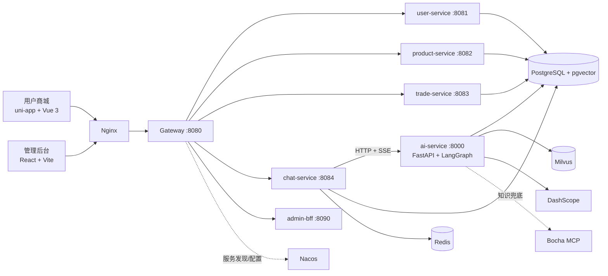
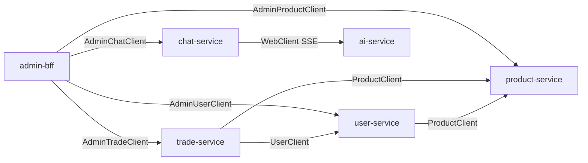
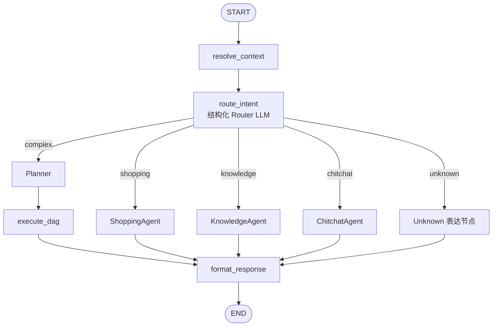

# WeLoveShop Agent Mall

WeLoveShop 是一个面向电商场景的全栈 AI 导购系统。它将 Java 微服务的商品、用户、交易和会话事实，与 Python `ai-service` 的 LangGraph 编排、DeepAgent Skills、RAG、图文检索和流式回答组合在一起。

项目的目标不是在商城页面嵌入一个通用聊天框，而是让 AI 在明确的业务边界内完成商品发现、已选商品比较、详情追问、知识问答、图文检索和复合任务拆解，并把可交互的商品卡片及 SSE 流式文本交给前端。

这个项目重点解决的是一个真实工程问题：**如何让大模型在微服务商城中可靠地理解任务、使用真实数据、保持多轮上下文，并以可观测、可评测、可降级的方式持续流式返回结果**。因此，项目同时包含完整商城业务和 Agent 工程化能力，而不是只展示一段 Prompt 或一个检索 Demo。

## 在线体验

- 用户端地址：[https://weloveshop.jwldu7521.cloud/](https://weloveshop.jwldu7521.cloud/)
- 当前生产环境暂未接入手机验证码登录。请在登录页点击“体验登录（无需手机号）”，系统会为本次体验创建独立的临时测试账号。
- 临时测试账号使用与普通用户相同的 JWT 和业务链路，但不同体验者之间的聊天、收藏、购物车和订单数据相互隔离。

## 项目亮点

| 工程问题 | 当前实现 | 解决的风险 |
| --- | --- | --- |
| Agent 流程不断写进 Prompt，扩展困难 | Shopping/Knowledge 使用 DeepAgent + 分 Agent Skills | 新能力按 Skill 扩展，职责和步骤按需加载 |
| 多个 Agent 重复理解完整历史 | Router 统一消解上下文，子 Agent 只接收隔离任务 | 降低指代误判、上下文污染和重复 Token |
| 商品召回结果可能跨品类或不满足约束 | Candidate Judge + 事实校验 + `exact/alternative` + 偏好软排序 | 防止无关商品卡和“假装满足” |
| 图文输入的文字目标与图片主体可能冲突 | `qwen3.5-flash` 图文一致性 Skill | 冲突时先澄清，不让错误条件直接进入召回 |
| 复杂问题一次性生成慢且不稳定 | Router → Planner → 受限 DAG → 子任务级 token SSE | 子任务隔离、同层并发、按语义顺序流式回复 |
| 长对话上下文持续增长 | 完整原文持久化 + 异步滚动摘要 + 最近消息窗口 | 不影响历史展示，同时控制后续模型上下文 |
| SSE、数据库消息和 Checkpointer 容易不一致 | 单一可见 token 通道、`final` 权威落库、运行时消息刷新 | 避免 token 双发、内部 JSON 外泄和历史重复 |
| 同会话并发发送可能产生重复消息 | Redis turn lock + `clientRequestId/turnId` 幂等 | 同会话串行、完成请求可重放、不同会话并行 |
| Agent 效果只能凭感觉判断 | Golden Dataset + 契约断言 + DeepEval + LangSmith Trace | 支持版本实验、失败归因、TTFT/Token/质量对比 |

## 技术栈

| 层次 | 技术 |
| --- | --- |
| Java 微服务 | Java 17、Spring Boot 3.2、Spring Cloud 2023、Spring Cloud Alibaba、OpenFeign、MyBatis Plus、Flyway |
| AI 应用 | Python 3.11+、FastAPI、LangGraph 1.x、LangChain 1.x、Deep Agents 0.7.1 |
| 模型与检索 | OpenAI-compatible LLM、DashScope、Qwen3 Rerank/VL、Milvus、pgvector、Bocha MCP |
| 数据与基础设施 | PostgreSQL 16、Redis 7、Nacos、OSS/MinIO、Docker Compose、Nginx |
| 用户端 | uni-app、Vue 3、POST SSE、结构化商品卡、受控 Markdown |
| 管理端 | React 19、Vite、ECharts |
| 观测与评测 | Trace ID、结构化日志、LangSmith、Golden Dataset、DeepEval、程序化 Evaluator |

## 文档导航

- [当前能力](#当前能力)
- [设计原则与取舍](#设计原则与取舍)
- [架构概览](#架构概览)
- [服务与职责](#服务与职责)
- [AI Assistant 设计](#ai-assistant-设计)
- [前端与交互协议](#前端与交互协议)
- [数据、记忆与基础设施](#数据记忆与基础设施)
- [关键业务链路](#关键业务链路)
- [可靠性与安全设计](#可靠性与安全设计)
- [评测与量化结果](#评测与量化结果)
- [本地开发](#本地开发)
- [观察使用建议](#观察使用建议)

## 当前能力

- 用户商城：商品浏览、搜索、收藏、地址、购物车、订单、聊天和图片上传。
- 管理后台：商品、用户、订单、会话、知识库、QA、公告、推荐日志和 Agent 运行记录管理。
- Skills 驱动导购：`ShoppingAgent` 和 `KnowledgeAgent` 基于 DeepAgent 按需读取领域 Skill，再调用受限的真实业务工具。
- 商品导购：按品类、预算、场景、品牌、肤质、偏好或避雷条件推荐；支持诚实替代、偏好软排序、商品卡回传。
- 商品追问：Router 先绑定商品 ID，随后才能比较已绑定商品或查询已绑定商品详情，避免 Agent 从历史自然语言猜测对象。
- 图文检索：支持纯文本、纯图片和图文组合检索；图文商品目标明显冲突时先澄清，视觉不确定时继续采用文字优先或图文检索。
- 知识问答：知识库混合检索、Rerank、证据约束回答；资料不足时可使用 Bocha Web Search 兜底并标注网络资料边界。
- 复杂请求：Router 识别复杂任务后，由 Planner 生成受限 DAG；同层子任务并发执行，结果按用户问题顺序逐 token 流式发布。
- 多轮上下文：`chat-service` 保存完整可见对话，异步维护持久化滚动摘要；Router 与 Chitchat 共享“摘要 + 最近原文”上下文。
- 可观测与评测：Trace ID、结构化日志、LangSmith 可选追踪、142 条 Golden Dataset、SSE 样本和本地 DeepEval 工具链。

## 设计原则与取舍

### 业务服务提供事实，AI 负责理解和编排

价格、库存、SKU、订单状态、收藏和用户权限都属于业务事实，不能由模型自由生成。Java 微服务负责事实与写操作；AI Service 负责意图判断、任务拆解、检索、筛选、证据归纳和自然语言表达。

例如，AI 可以返回推荐商品卡和加购建议，但真正的购物车写入仍由前端在用户确认后调用 `trade-service`。这能避免 Agent 越权修改业务数据，也让事务、鉴权和幂等继续由传统业务层负责。

### 结构化协议优先于从自然语言反解析

AI 链路除了回答文本，还维护 `product_cards`、`sources`、`route`、`task_type`、`tool_calls`、DAG 子任务结果和错误码。前端按结构化事件渲染商品卡、确认状态和流式文本，不从 LLM 回答中正则提取商品 ID、价格或操作指令。

### 上下文理解集中在 Router

“第一款”“它”“刚才那两个”之类指代必须在领域 Agent 之前解决。Router 使用可见对话、持久化商品卡和业务记忆完成绑定；Shopping/Knowledge 只消费当前已消解问题。这个边界既减少重复理解，也防止 Agent 从任意历史文本猜测错误商品。

### 受控自治，而不是无限自治

项目允许 Agent 自己选择 Skill 和领域工具，但不会给它 Shell、任意文件写入、自由创建子 Agent或直接修改业务数据库的权限。不可协商的安全边界放在 Tool Guard、Middleware、Schema 和服务层；可扩展的任务方法放在 Skill 中。

### 真实降级，而不是伪造成功

PostgreSQL runtime 不可用时可降级为内存 Checkpointer；知识库无有效证据时可使用网络搜索；候选不满足用户硬约束时返回可替代或空结果。降级路径必须保留明确来源和边界，不能为了“始终有答案”而编造商品或知识事实。

## 架构概览



生产环境由 Nginx 承担 HTTPS、静态站点和 `/api/**` 反向代理；Gateway 负责业务 API 路由和鉴权；`chat-service` 是用户聊天 SSE 与 `ai-service` 之间的业务桥梁。前端不直接调用 AI 服务。

### 接入层分工

```text
Browser
  -> Nginx               HTTPS、前端静态资源、/api 反向代理、SSE 代理配置
  -> Gateway             显式路由、JWT/CORS、Nacos 服务发现
  -> Java domain service 业务事实、鉴权、事务、持久化
  -> ai-service          理解、检索、Agent 编排、流式表达
```

Nginx 和 Gateway 并不重复：前者是公网 Web 入口，后者是内部业务 API 网关。本地开发可由 Vite/uni-app 开发服务器代理 `/api`，因此通常不需要启动 Nginx。

### Gateway 路径规则

| 客户端路径 | 目标服务 | 转发后的典型 Controller 路径 |
| --- | --- | --- |
| `/api/user/**` | `user-service` | `/api/user/auth/profile` → `/auth/profile` |
| `/api/product/**` | `product-service` | `/api/product/product/list` → `/product/list` |
| `/api/trade/**` | `trade-service` | `/api/trade/cart/list` → `/cart/list` |
| `/api/chat/**` | `chat-service` | `/api/chat/chat/stream/messages` → `/chat/stream/messages` |
| `/api/admin/**` | `admin-bff` | `/api/admin/dashboard/stats` → `/dashboard/stats` |

Gateway 使用显式路由和前缀剥离。排查 404 时必须同时核对浏览器路径、Gateway 前缀与 Controller 路径。

## 服务与职责

| 模块 | 默认端口 | 职责 |
| --- | ---: | --- |
| `gateway` | 8080 | Spring Cloud Gateway、路由、JWT/CORS、Nacos 服务发现 |
| `services/user-service` | 8081 | 登录、JWT、用户资料、地址、收藏、浏览记录、独立临时体验登录 |
| `services/product-service` | 8082 | 分类、商品、SKU、图片、评价、FAQ、搜索和推荐日志 |
| `services/trade-service` | 8083 | 购物车、订单、模拟支付、发货和收货 |
| `services/chat-service` | 8084 | 会话、消息、图片上传、聊天 SSE、知识文档、QA/Agent 日志、滚动摘要持久化 |
| `admin-bff` | 8090 | 管理员认证与面向管理后台的 Feign 聚合接口 |
| `ai-service` | 8000 | FastAPI、LangGraph、DeepAgent、检索、RAG、图文能力和 LangSmith 追踪 |
| `web/welove-shop` | 开发服务器 | uni-app + Vue 3 用户端（H5） |
| `web/admin-web` | 开发服务器 | React + Vite 管理后台 |

Java 服务的活跃业务数据使用 PostgreSQL 的独立 schema：`user_svc`、`product_svc`、`trade_svc`、`chat_svc`、`admin_svc`。MySQL 只保留给历史数据迁移脚本，不应作为新业务的默认写入目标。

### Java 公共能力

- `common-core`：统一 `Result<T>`、分页、业务异常、错误码和基础工具。
- `common-web`：Spring MVC 全局异常处理和 Web 自动配置。
- `common-db`：MyBatis Plus、基础实体、字段自动填充和数据库配置。
- `common-security`：JWT 签发/解析、认证拦截器和 `UserContext`。
- `common-storage`：OSS 与本地存储的统一 `StorageService` 抽象。

### 领域服务说明

`user-service` 负责普通登录、验证码、Token 刷新、画像、地址、收藏和浏览记录。体验登录不再从固定 5 个账号轮询，而是每次创建独立 `is_test=true` 用户，避免不同面试官或不同浏览器共享聊天、订单和收藏数据；接口仍复用普通 JWT 协议并保留 Redis 频控。

`product-service` 是商品目录的事实所有者，维护分类、品牌、商品、SKU、图片、FAQ、评价和推荐行为日志。商品主数据来自 PostgreSQL `product_svc`，Redis 只承担热点缓存；AI 的向量检索不能替代商品事实查询。

`trade-service` 负责购物车和订单状态机。创建订单时通过 Feign 校验商品/SKU并保存价格、标题、图片和规格快照，保证后续商品变更不会污染历史订单。

`chat-service` 保存会话、用户/助手消息、商品卡、来源、状态和 Agent 元数据，并以 WebClient 转发 AI SSE。它还负责消息停止、截断状态、同会话并发锁、请求幂等、图片上传、知识文档和异步滚动摘要。

`admin-bff` 不直接跨库读取其他服务数据，而是通过 Feign 聚合用户、商品、订单、会话、知识库和 Agent 观测数据，向 React 管理端提供稳定接口。

### 微服务调用关系



服务间调用保持数据所有权：调用方依赖对方 API/DTO，不依赖对方数据库表。跨服务接口变更时，需要同步检查提供方 Controller、Feign Client、调用方 DTO 和最终前端假设。

## 仓库结构

```text
welove-shop-agt/
├─ gateway/                       # Spring Cloud Gateway
├─ common/                        # Result、异常、安全、DB、存储等共享模块
├─ services/
│  ├─ user-service/
│  ├─ product-service/
│  ├─ trade-service/
│  └─ chat-service/
├─ admin-bff/                     # 管理端 BFF
├─ ai-service/
│  ├─ app/api/                    # FastAPI 路由、Schema、SSE、错误映射
│  ├─ app/application/assistant/  # 主图、Router、Planner、DAG、上下文处理
│  ├─ app/domain/shopping/        # 导购 Agent、候选链、图文检索、工具
│  ├─ app/domain/knowledge/       # Knowledge Agent、RAG、文档处理
│  ├─ app/domain/chitchat/        # 闲聊 Agent
│  ├─ app/infrastructure/         # LLM、持久化、向量库、客户端、观测
│  ├─ skills/                     # Agent 专属 SKILL.md 与受控脚本
│  ├─ evals/                      # Golden Dataset、LangSmith/DeepEval 运行器
│  └─ tests/
├─ web/
│  ├─ welove-shop/                # uni-app 用户端
│  └─ admin-web/                  # React 管理端
├─ infra/                         # 本地 PostgreSQL、Redis、Milvus、Nacos、RocketMQ
├─ deploy/                        # 生产 Docker Compose、镜像和配置模板
└─ docs/                          # API、迁移、验收、评测和设计文档
```

## AI Assistant 设计

### 主图与路由

`ai-service` 的主入口是 `main.py:app`，主要公开接口位于 `/api/assistant`。每个请求由 `AssistantGraph` 按以下顺序处理：



`resolve_context` 先恢复当前会话的可见上下文、商品卡工件和业务记忆。Router 使用一次结构化 LLM 输出 `shopping`、`knowledge`、`chitchat`、`unknown` 或 `complex`；它负责跨轮指代、商品绑定、图片作用域和任务类型判断。Router 当前是结构化路由节点，不是 DeepAgent。

复杂问题只在 Router 已判定为 `complex` 后进入 Planner。Planner 生成最多 5 个、有依赖关系的子任务；同一拓扑层最多 3 个并发执行。下游子任务只拿到当前无指代问题、Router 绑定对象、依赖 Artifact、被授权图片和基础偏好，不重复读取完整会话历史。为了让对话顺序稳定，SSE 仍按 Planner 的任务顺序逐 token 输出。

Router 的主要输出不是一段自然语言，而是稳定的路由契约：

| 字段 | 作用 |
| --- | --- |
| `mode` | `simple` 或 `complex`，决定是否进入 Planner |
| `task_type` | `shopping`、`knowledge`、`chitchat`、`unknown` |
| `canonical_question` | 已消解指代、可交给下游的当前完整问题 |
| `resolved_product_ids` | Compare/Detail 唯一允许使用的商品绑定 |
| `resolved_knowledge_entities` | 跨轮知识实体绑定 |
| `image_query_mode` | 图片是否参与图文检索 |
| `confidence` / `clarification` | 低置信度与澄清语义 |

简单问题不经过 Planner，避免无意义增加一次模型调用；复杂问题也不再使用一个最终总结 LLM 等待所有结果，而是由子任务各自生成用户可见 token，最终节点只聚合兼容字段和结构化卡片。

### Skills 驱动的领域 Agent

Shopping 和知识链路默认启用 `deepagents==0.7.1`。系统 Prompt 只保留职责和边界，具体处理步骤由 Agent 读取匹配的 `SKILL.md` 获得；这使新增领域能力可以通过新增 Skill 和受限工具扩展，而不是持续堆叠固定 Prompt 分支。

| Agent | Skill | 用途 |
| --- | --- | --- |
| Shopping | `discover-products` | 文本、纯图、图文商品发现与推荐 |
| Shopping | `compare-products` | 比较 Router 已绑定的多个商品 |
| Shopping | `inspect-product` | 查询 Router 唯一绑定商品的实时详情 |
| Shopping | `use-shopping-profile` | 用户明确要求时读取画像、收藏、浏览或订单辅助信息 |
| Shopping | `multimodal-consistency` | 图文商品目标一致性检查 |
| Knowledge | `answer-with-evidence` | 基于检索证据回答常规知识问题 |
| Knowledge | `answer-safety-question` | 孕妇、药物、疾病、剂量等高风险知识问题 |

DeepAgent 的文件系统仅允许读取其所属的 Skill 目录；通用 `execute`、写文件、删文件、创建子 Agent、全盘搜索等工具不对模型开放。Shopping Skill 脚本也不是 Shell：仅可通过白名单运行器执行仓库内已登记的确定性脚本，输入必须来自可信工具结果。

Skill、Tool、Script 和 Guard 的职责有意分开：

| 层次 | 负责什么 | 不负责什么 |
| --- | --- | --- |
| Skill | 描述某类任务的判断顺序、工具使用方式、空结果和事实边界 | 不查询数据库，不制造事实 |
| Tool | 调用真实检索、商品事实、用户上下文或知识能力 | 不承担跨轮指代理解 |
| Script | 单位归一、SKU 汇总、偏好稳定排序等确定性计算 | 不调用 Shell，不生成候选和业务事实 |
| Guard/Middleware | Skill 前置读取、同参数去重、工具次数、模型次数、绑定 ID 和权限边界 | 不替代 Agent 的语义决策 |

这种拆分保留了 Agent 的任务理解能力，又把安全性和不可协商的约束放回代码层。新增商品能力时，通常先定义 Skill，再复用或增加一个边界清晰的 Tool；只有真正确定性的重复处理才增加 Script。

### 商品候选与图文链路

商品发现使用真实候选召回、Candidate Judge、事实校验、基础偏好软排序和商品卡构造。硬约束（如品类、明确预算）决定是否命中；肤质、使用感和偏好仅在相关候选中参与软排序，不能改变商品品类命中语义。

- 文本：混合检索与 Rerank。
- 纯图片：图片向量检索。
- 图文：三路融合或视觉 Rerank；进入推荐前由 `qwen3.5-flash` 做轻量图文一致性检查。
- 明确冲突：询问用户按图片还是按文字继续。
- 视觉不确定：不中断或空回复；文字目标明确时文字优先，否则保留图片参与检索。

一次商品发现请求大致经历：

```text
Router 已消解问题与图片作用域
  -> Shopping DeepAgent 读取 discover-products Skill
  -> 图文模式时读取 multimodal-consistency Skill 并执行视觉预检
  -> search_product_candidates 统一召回一次
  -> CandidateSet 暂存真实候选
  -> finalize_product_recommendation 复用一次 LLM-as-Judge
  -> exact / alternative / reject
  -> 对 exact/alternative 进行基础偏好相关度排序
  -> 事实校验、商品卡构造
  -> Agent 依据结构化结果逐 token 表达
```

`exact` 表示候选满足当前明确条件；`alternative` 必须与用户目标属于同类商品，但存在明确约束差距，并通过 `constraint_gaps` 诚实说明；`reject` 不进入用户可见商品卡。偏好分数只能重排已经命中的候选，不能把低相关商品“抬成”命中。

Compare 和 Detail 采用另一条更严格的链路：Router 必须先从可见商品卡绑定 ID，ShoppingAgent 再通过 `load_bound_product_facts` 一次读取真实事实。绑定失败、序号越界或对象数量不符合要求时，只能澄清，不能重新推荐或从回答正文猜商品。

### 知识检索与安全边界

KnowledgeAgent 必须先读取知识 Skill，再调用 `search_knowledge` 获取证据。内部知识库使用混合检索、Rerank 和 Milvus；资料不足时可由 Bocha MCP 进行网络搜索兜底。使用网络资料时回答须明确“来自网络搜索，仅供参考”；没有可靠证据时不使用训练知识补写事实。高风险健康问题不得给出诊断、处方、确定疗效或超出证据的剂量建议。

```text
Router 判定 knowledge
  -> Knowledge DeepAgent 先读取常规或安全问答 Skill
  -> search_knowledge（最多 2 次，第二次必须是明显不同的有效查询）
  -> Milvus hybrid recall + qwen3-rerank
  -> 内部资料不足时按配置触发 Bocha MCP
  -> 基于 knowledge_context 与 sources 回答
  -> 保留网络来源和高风险免责声明
```

知识工具在 Skill 加载前不会暴露给模型，Middleware 也会阻止 Agent 在没有真实检索结果时直接结束。这不是用固定答案替代模型，而是确保知识回答始终经过证据链。

### 上下文、消息与流式返回

系统把“聊天记录”“模型输入”“Agent 工作状态”和“业务记忆”分开管理：

| 数据 | 保存位置 | 生命周期 | 消费者 |
| --- | --- | --- | --- |
| 完整可见消息 | PostgreSQL `chat_svc.message` | 长期保留 | 前端历史、摘要任务、下一轮上下文准备 |
| 滚动摘要与水位 | `chat_svc.conversation_context` | 随会话滚动更新 | Router、Chitchat |
| 最近原文窗口 | 每轮由 chat-service 查询 | 当前请求 | Router、Chitchat |
| LangGraph `state.messages` | Checkpointer / 当前图状态 | 运行时 | 主图节点；不是业务真相 |
| 商品卡/焦点商品/偏好 | 消息 Artifact 与 Store | 会话或用户维度 | Context Resolver、Router、Shopping |
| DAG 依赖 Artifact | 当前图 state | 当前复杂请求 | 明确依赖它的后置子任务 |

默认在 20 条用户/助手可见消息后触发一次摘要，保留最近 4 条原文。`chat-service` 在当前助手回答完成落库后异步调用 `/api/assistant/conversation-summary`，摘要成功后原子更新摘要和覆盖水位。原始消息不会删除，因此前端历史展示、审计和重新生成摘要都仍有完整依据。

下一轮 `resolve_context` 统一注入摘要与最近原文，Router 和 Chitchat 不会各自维护两份可能不一致的总结。Shopping/Knowledge 不读取这份完整会话，只获取 Router 已解析的当前任务。

SSE 用户可见内容采用单通道：`token` 负责增量文本，`final.answer` 是落库的权威最终答案，`done` 结束流。Candidate Judge JSON、工具调用 chunk 和 `ai_internal` 消息只用于运行时与 LangSmith Trace，不会显示或保存成用户回答。

复杂 DAG 内部同层并发，但可见 token 按 Planner 顺序发布。后一个任务先完成时会暂存其 token，等前序任务发布后再继续，避免用户先看到“问题 2”又跳回“问题 1”。

## 前端与交互协议

### 用户端 `web/welove-shop`

用户端使用 uni-app + Vue 3，覆盖商品列表、详情、收藏、购物车、订单、地址、个人资料和 AI 对话。聊天页支持：

- 文本、纯图片和图文消息；图片先上传 OSS，再把公网 URL 交给 AI。
- POST SSE 流式读取，因为原生 `EventSource` 无法携带 JSON body 和 Authorization。
- 单会话流继续在后台运行，页面切换后可恢复显示。
- 停止生成、截断状态、重试、新消息提示和同会话 busy 提示。
- 商品卡、SKU 选择、加购、确认卡和批量选择卡。
- 助手回答的受控 Markdown 渲染；用户文本不进行 HTML 注入。

前端不会根据回答文本执行写操作。商品卡点击后通过 `product-service` 加载事实；加购由用户确认并直接调用 `trade-service`。

### 管理端 `web/admin-web`

管理端使用 React + Vite，通过 `admin-bff` 查看和维护用户、商品、订单、会话、知识库、QA、公告、Agent Runs、Tool Calls 和推荐统计。ECharts 用于仪表盘和运营指标；管理员 Token 与普通用户 Token 使用不同角色语义。

## 数据、记忆与基础设施

### PostgreSQL 与 Flyway

一个 PostgreSQL 实例按 schema 隔离微服务数据：

| Schema | 所有者 | 主要数据 |
| --- | --- | --- |
| `user_svc` | user-service | 用户、地址、收藏、浏览历史 |
| `product_svc` | product-service | 分类、商品、SKU、图片、评价、推荐日志 |
| `trade_svc` | trade-service | 购物车、订单、订单项和状态 |
| `chat_svc` | chat-service | 会话、消息、摘要、知识文档、QA 和 Agent 日志 |
| `admin_svc` | admin-bff | 管理员账号和管理侧配置 |
| `public` / AI runtime | ai-service | LangGraph checkpoint/store、pgvector 等 AI 运行数据 |

每个 Java 服务只通过自己的 Flyway 目录演进 schema。已经执行的迁移不能修改，否则会导致 checksum 不一致；新变更必须新增下一版本迁移。

### Redis、Milvus 与对象存储

- Redis：验证码、缓存、短期上下文兼容路径、会话 turn lock、请求幂等和缓存失效。
- Milvus：知识向量、商品文本向量、BM25 sparse 字段和图片/多模态向量。
- pgvector：商品或运行时检索的兼容/降级路径。
- OSS/MinIO：聊天图片与知识文档；交给视觉模型的图片必须是公网可访问的 HTTPS URL。
- Nacos：Java 服务发现与非敏感动态配置；密码、JWT、云密钥不能存入 Nacos。

## 关键业务链路

### 文本导购

```text
H5 -> Gateway -> chat-service
   -> 保存 user message / 创建 assistant 占位
   -> ai-service /assistant/stream
   -> resolve_context -> Router -> Shopping Skill -> 检索/Judge/卡片
   -> token/product_cards/final/done
   -> chat-service 转发 SSE、以 final 为准落库并失效缓存
   -> H5 增量渲染文本和结构化商品卡
```

### 图文导购

```text
H5 上传图片 -> chat-service -> OSS 公网 URL
  -> Router 判断图片作用域
  -> shopping + multimodal 才执行图文一致性 Skill
  -> conflict：澄清按图还是按文字
  -> consistent/uncertain：图片/文字/三路候选召回
  -> Candidate Judge -> 商品卡 -> SSE
```

### 多轮比较与详情

第一轮推荐结果的商品卡随助手消息持久化。第二轮用户说“比较第一款和第三款”时，Context Resolver 恢复最新卡片集合，Router 将序号解析为受验证的商品 ID；越界时直接询问“当前只有两款，是否要比较前两款”，不会让 ShoppingAgent 猜测不存在的商品。

### 复杂任务

“推荐一款抗初老精华、一款男士跑鞋、一款 iPhone”会先被 Router 标记为复杂，再由 Planner 生成三个互不依赖的 shopping 子任务。同层任务并发执行，每个子任务保持自己的 Skill/Tool/Judge 链路和 token 流；单任务默认硬超时 60 秒，部分失败会保留其他成功结果并返回明确错误元数据。

### 滚动摘要

当前轮正常完成后，`chat-service` 判断可见消息是否超过阈值；达到阈值时只总结水位之后、窗口之前的消息前缀，将新摘要与水位原子写回。下一轮继续使用摘要加最近原文，不会每轮重复总结同一批消息。

## 可靠性与安全设计

- JWT 与 `UserContext`：用户身份来自 Token，不信任请求体中的任意 userId。
- 临时体验登录：每次生成独立测试账号；保留 IP/全局频控，公网可通过配置关闭。
- 会话并发：Redis `SET NX PX` 锁保证同一会话只有一个 AI turn；Lua 按 owner 安全释放。
- 请求幂等：相同 `clientRequestId/turnId` 处理中返回明确状态，完成后直接重放，不重复调用 AI 或落库。
- SSE 断流：上游异常、用户停止或连接取消都会把助手消息标记为 `truncated`，不会伪装为完整回答。
- Tool Guard：限制相同参数推荐、模型/工具调用次数、Skill 前置读取、商品绑定和图文预检顺序。
- 事实约束：价格、库存、SKU、成分、评分和来源必须来自工具结果；结构化商品卡由系统传给前端。
- 隐私观测：LangSmith 默认隐藏输入输出，只上报哈希化会话/用户引用和必要元数据。
- 依赖降级：外部服务不可用时返回可诊断的空结果或稳定错误，不将内部异常 JSON 输出给用户。

## 本地开发

### 前置条件

- JDK 17、Maven 3.9+。
- Python 3.11+。`deepagents==0.7.1` 是当前锁定版本；Docker 镜像使用 Python 3.12。
- Node.js LTS 与 npm。
- Docker Desktop（用于 PostgreSQL、Redis、Milvus、Nacos 等本地依赖）。
- 可用的 LLM 与 DashScope 凭据；缺失 LLM 时 AI 服务只会返回稳定错误响应。

### 启动基础设施

在 `infra/` 目录中按需启动：

```powershell
cd infra
docker compose -f docker-compose.yml up -d
docker compose -f milvus-standalone-docker-compose.yml up -d
docker compose -f nacos-standalone-docker-compose.yml up -d
```

RocketMQ 仅在相关功能或演示需要时启动：

```powershell
docker compose -f rocketmq-docker-compose.yml up -d
```

本地端口及账号速查见 [infra/README.md](infra/README.md)。PostgreSQL、Redis、Milvus 和 Nacos 是完整 AI 导购链路的主要依赖；服务不可用时部分能力会按现有降级策略运行，但不能把降级结果当作完整验收结果。

### 配置并启动 AI Service

```powershell
cd ai-service
Copy-Item .env.example .env
# 在 .env 中填写 LLM_API_KEY、LLM_MODEL、LLM_BASE_URL、DASHSCOPE_API_KEY 等真实配置
python -m venv .venv
.\.venv\Scripts\Activate.ps1
pip install -r requirements.txt
uvicorn main:app --reload --port 8000
```

不要把真实 `.env`、密钥、数据库密码或 LangSmith Key 提交到仓库。AI 服务启动后可检查：

```powershell
curl.exe http://127.0.0.1:8000/health/live
curl.exe http://127.0.0.1:8000/health/ready
```

常用 AI 配置分组：

| 配置组 | 关键变量 |
| --- | --- |
| LLM | `LLM_API_KEY`、`LLM_MODEL`、`LLM_BASE_URL` |
| DashScope | `DASHSCOPE_API_KEY`、`DASH_SCOPE_API_KEY`、embedding/rerank/multimodal 模型变量 |
| 数据与检索 | `PG_*`、`MILVUS_*`、`RAG_*`、`IMAGE_BASE_URL` |
| Skills | `SHOPPING_DEEP_AGENT_ENABLED`、`KNOWLEDGE_DEEP_AGENT_ENABLED`、`*_SKILLS_ROOT`、`SHOPPING_SKILL_SCRIPT_MODE` |
| 图文一致性 | `SHOPPING_MULTIMODAL_CONSISTENCY_*` |
| 复杂编排 | `ORCHESTRATOR_MAX_TASKS`、`ORCHESTRATOR_MAX_CONCURRENCY`、`ORCHESTRATOR_TASK_TIMEOUT_SECONDS` |
| 会话摘要 | `CONVERSATION_SUMMARY_ENABLED`、`CONVERSATION_SUMMARY_TRIGGER_MESSAGES`、`CONVERSATION_SUMMARY_KEEP_MESSAGES`、`CONVERSATION_SUMMARY_MAX_CHARS` |
| 观测 | `LANGSMITH_TRACING`、`LANGSMITH_API_KEY`、`LANGSMITH_PROJECT`、`LANGSMITH_HIDE_INPUTS`、`LANGSMITH_HIDE_OUTPUTS` |

`chat-service` 与 AI 服务必须使用一致的 `CONVERSATION_SUMMARY_*` 配置。默认摘要在 20 条可见消息后触发，保留最近 4 条原文；完整原始消息不会被摘要删除，也不会影响前端历史展示。

### 启动 Java 服务

从仓库根目录按依赖顺序启动。各服务使用本地 `application.yml`，并可从 Nacos 加载可选配置；Flyway 会在各服务自己的 schema 上执行迁移。

```powershell
mvn -pl services/user-service -am spring-boot:run
mvn -pl services/product-service -am spring-boot:run
mvn -pl services/trade-service -am spring-boot:run
mvn -pl services/chat-service -am spring-boot:run
mvn -pl admin-bff -am spring-boot:run
mvn -pl gateway -am spring-boot:run
```

`chat-service` 通过 `AI_SERVICE_URL` 调用 `http://127.0.0.1:8000/api`。正常前端验收应经过 Gateway：`/api/user/**`、`/api/product/**`、`/api/trade/**`、`/api/chat/**`、`/api/admin/**`。

### 启动前端

```powershell
# 用户端 H5
cd web/welove-shop
npm install
npm run dev:h5

# 管理端（另开终端）
cd web/admin-web
npm install
npm run dev
```

用户端聊天页使用 POST SSE：`/api/chat/chat/stream/messages`。助手文本支持标题、粗体、列表和换行的受控 Markdown 渲染；商品卡片、确认卡和购物车交互继续使用结构化事件，而不是从文本中解析。

## API 与数据契约

外部业务请求应优先经过 Gateway。AI Service 的接口主要供 `chat-service` 和内部评测使用：

| AI 接口 | 用途 |
| --- | --- |
| `POST /api/assistant/run` | 同步运行 AssistantGraph |
| `POST /api/assistant/stream` | SSE 流式运行 AssistantGraph |
| `POST /api/assistant/multimodal/run` | 同步图文请求 |
| `POST /api/assistant/multimodal/stream` | 图文 SSE 请求 |
| `POST /api/assistant/conversation-summary` | 供 chat-service 异步维护滚动摘要的内部接口 |
| `POST /api/rag/*` | 文档解析、检索和管理相关内部接口 |

改动聊天请求、SSE 事件、商品卡字段、图片字段或消息持久化时，必须同时检查 `ai-service`、`services/chat-service` 和 `web/welove-shop`，三者共同组成一个接口契约。

主要 SSE 事件语义：

| 事件 | 语义 |
| --- | --- |
| `start` | 一次 Assistant 请求开始，携带 Trace/Run 元数据 |
| `route` | Router 已完成分类 |
| `orchestrator_plan` | 复杂任务规划完成 |
| `orchestrator_subtask` | 子任务即将按顺序向用户发布 |
| `token` | 唯一的用户可见增量文本通道 |
| `product_cards` | 结构化商品卡 |
| `subtask_result` | 复杂子任务完成状态与观测字段 |
| `final` | 权威最终答案、卡片、来源和任务元数据 |
| `error` | 稳定错误码与用户可读消息 |
| `done` | SSE 生命周期结束 |

## 评测与量化结果

`ai-service/evals/datasets/agent_golden_cases.jsonl` 是当前 Golden Dataset 的本地唯一编辑源，共 142 条，覆盖 Shopping、Knowledge、Chitchat、复杂 DAG、图文检索和对抗输入。

- 程序化契约用于路由、工具、商品卡、SSE 生命周期和复杂任务断言。
- DeepEval 仅通过显式参数执行 LLM-as-a-Judge，不进入线上主链。
- `LANGSMITH_TRACING=true` 且配置 API Key 后，LangChain/LangGraph 调用会带有请求、路由、Agent、工具和 Planner 子运行追踪。生产默认建议隐藏输入和输出。
- `/stream` 的体验应使用 TTFT、事件闭环和总完成时间衡量；不要用同步 `/run` 的总耗时替代前端首 token 时间。

### Contract、Tool Correctness 与 DeepEval 是什么

这三类指标解决的问题不同，不能把它们混成一个“Agent 准确率”：

| 指标 | 计算方式 | 回答的问题 | 局限 |
| --- | --- | --- | --- |
| Contract Pass Rate | 对每条 Golden Case 执行确定性断言；该 Case 配置的检查必须全部通过 | 路由、任务类型、必需工具、回答非空、商品卡、品类、DAG 子任务、SSE、错误和延迟契约是否满足 | 断言或旧 SLA 过时会压低结果，不评价文案是否自然 |
| Tool Correctness | DeepEval 将实际 `tool_calls` 与 Golden Case 的 `required_tools` 比较 | Agent 是否选择了完成任务所需的工具，是否调用了错误或多余工具 | 不代表工具结果正确，也不代表最终回答正确；依赖工具名契约准确 |
| Task Completion | DeepEval LLM-as-a-Judge 阅读问题、回答和工具轨迹后评分 | 用户任务是否真正完成 | 有模型主观性和额外成本，需要固定 Judge 模型与阈值 |
| Task Success / Pass@1 | Contract 通过；启用 Judge 时还要求 Judge 通过 | 一次执行、不重试时的综合成功情况 | 会同时受确定性契约和 Judge 影响 |

Contract 是低成本、可重复的提交门禁。例如某条用例要求 `route=shopping`、必须出现商品卡、品类为耳机并完成 `start → token → final → done`，其中任意一项失败，该 Case 的 Contract 就失败。因此 `82.39%` 表示 142 条中的 117 条满足了当前采用的功能契约，不等于模型主观回答质量为 82.39 分。

Tool Correctness 只检查工具选择。Agent 调用了正确的 `search_knowledge`，但引用错误证据，Tool Correctness 仍可能通过；反过来，如果 Golden Dataset 仍写旧工具名 `recommend_products`，而 Skills 运行时使用 `search_product_candidates` 与 `finalize_product_recommendation`，即使业务链正确也可能被判失败。当前该指标需要完成工具别名和聚合分母校准后才适合作为展示指标。

旧报告中的 `131.25%` 来自明确的聚合错误：30 条样本中只有 16 条产生了 Tool Correctness 分数，其中 7 条通过；另有 14 条因未配置 `required_tools` 而跳过，却被旧代码错误计入通过数，最终得到 `(7 + 14) / 16 = 131.25%`。修正同一批结果的算术口径后是 `7 / 16 = 43.75%`，但由于工具别名契约尚未校准，该值仍只用于定位评测问题，不作为系统能力结论。

当前 DeepEval 实际执行的是 `TaskCompletionMetric` 和 `ToolCorrectnessMetric`，阈值为 `0.6`；`GoalAccuracyMetric` 因当前单轮数据不具备完整 plan trajectory 已明确跳过，不能把跳过项计成通过。

### 最近一次完整稳定基线

以下数据来自仓库中最近一次固化的完整实验，基线版本为 `58d26e4`，生成于 2026-08-06。之后的提交包含复杂任务超时、并发治理、临时登录和前端渲染修复，因此这些数字是**可复现实验基线**，不是对当前每次运行结果的实时承诺。

| 评测 | 样本 | 结果 | 正确解读 |
| --- | ---: | ---: | --- |
| 端到端 Golden Dataset | 142 | 功能契约 82.39%（117/142） | 排除已经不适合当前同步链路的旧延迟 SLA |
| Shopping 功能契约 | 46 | 84.78% | 商品发现、比较、详情、画像和卡片 |
| Knowledge 功能契约 | 32 | 93.75% | 内部证据、网络兜底与多轮知识问题 |
| Chitchat 功能契约 | 32 | 81.25% | 闲聊、回顾和能力边界 |
| 复杂 DAG 功能契约 | 12 | 66.67% | 该基线之后已补充子任务超时与稳定性修复 |
| 多模态功能契约 | 20 | 70.00% | 纯图、图文和冲突澄清 |
| SSE 体验样本 | 24 | 24/24 完成事件闭环 | 每条均出现用户可见 token，未发生流断 |
| 本地 DeepEval | 30 | Task Completion 均分 0.7293，通过率 70% | 样本包含越权和系统能力外问题 |
| Knowledge DeepEval | 8 | 8/8 通过 | 仅表示该定向子集 |

24 条真实 SSE 样本中，TTFT 为 P50 `12.56s`、P95 `30.46s`；总完成时间为 P50 `20.42s`、P95 `39.86s`。多模态和复杂 DAG 首 token 前需要视觉检查、检索或规划，仍是后续性能优化重点。

### 滚动摘要 A/B 实验

滚动摘要使用 20 个长会话、每个场景 3 次连续追问，共 60 次后续请求进行对照：

| 指标 | 完整历史 | 摘要 + 最近 4 条 | 变化 |
| --- | ---: | ---: | ---: |
| 上下文字符总量 | 495,530 | 14,936 | -97.0% |
| 后续推理 Token | 521,852 | 219,712 | -57.9% |
| 计入一次摘要成本后的总 Token | 521,852 | 330,747 | -36.6% |
| 路由正确率 | 96.67% | 96.67% | 持平 |
| 连续会话通过率 | 90% | 95% | +5 个百分点 |
| P95 总耗时 | 32.963s | 32.620s | 基本持平 |

结果说明滚动摘要的主要收益是长会话上下文和成本控制，而不是显著降低领域 Agent 的检索/工具耗时。完整实验口径见 [滚动摘要量化结果](docs/plan/rolling-summary-quantitative-results.md)。

### RAG 分块策略性能对比

知识库不是统一把所有内容按字符硬切。商品知识天然具有业务结构：营销描述单独成块、每条 FAQ 独立成块、每 3 条评价组成评价块；实验主要比较通用知识文档如何切分，以及是否采用“子块检索、父块回填”。

实验固定了 32 条 Knowledge Case、`text-embedding-v4`、`qwen3-rerank`、Top20 初召回和 Top5 最终上下文。其中 16 条具备人工相关性等级，用于检索指标；RAGAS 根据各指标实际成功样本计算，因此表中同时保留有效样本数。

| 策略 | 通用知识组织 | Contract | P50 / P95 | Recall@5 | MRR@5 | NDCG@5 |
| --- | --- | ---: | ---: | ---: | ---: | ---: |
| v2.1 固定单层（当前默认） | 固定 `500/50` | 93.75% | 12.42s / 26.38s | 0.8646 | 0.8646 | 0.8381 |
| `semantic_v1` | 按 Markdown `##/###` 主题切分 | 87.50% | 11.95s / 26.20s | 0.8021 | 0.8125 | 0.7838 |
| mixed fixed parent-child（最强候选） | 父 `1000/100`、子 `500/50`，仅通用知识父子回填 | 90.62% | 12.77s / 18.43s | 0.8646 | 0.8750 | 0.8463 |
| semantic + recursive general | 通用知识递归 `500/50` | 90.62% | 12.92s / 23.68s | 0.8646 | 0.8750 | 0.8463 |

检索指标含义：

- `Recall@5`：人工标注的相关知识是否进入 Top5，主要衡量是否漏召回。
- `MRR@5`：第一个相关结果出现得有多靠前，越靠前分数越高。
- `NDCG@5`：综合多个结果的相关等级和排序位置，衡量整个 Top5 排序质量。
- `P50/P95`：32 条端到端 Knowledge 请求的完成耗时，只作整体性能观察，不能把所有耗时差异都归因于分块。

同一批实验的 RAGAS 结果：

| 策略 | Answer Relevancy | Context Precision | Context Recall | Faithfulness |
| --- | ---: | ---: | ---: | ---: |
| v2.1 固定单层 | 0.7741（n=25） | 0.7358（n=20） | 0.6842（n=20） | 0.7187（n=25） |
| `semantic_v1` | 0.7822（n=26） | 0.7365（n=20） | 0.6800（n=20） | 0.7111（n=26） |
| mixed fixed parent-child | 0.7843（n=26） | **0.8540（n=21）** | **0.7341（n=21）** | 0.7036（n=26） |
| semantic + recursive general | 0.7363（n=27） | 0.7633（n=20） | 0.6300（n=20） | 0.6967（n=27） |

RAGAS 四项指标分别表示：

- `Answer Relevancy`：最终回答是否真正回应用户问题。
- `Context Precision`：送给生成模型的检索上下文是否干净，相关内容是否排在前面。
- `Context Recall`：参考答案所需的信息是否被检索上下文覆盖。
- `Faithfulness`：回答中的事实声明是否可以由检索上下文支持，用于观察幻觉风险。

实验结论不是“父子分块一定更好”，而是**商品知识保留语义块，只有通用知识使用 fixed parent-child** 的混合策略最有希望。它相对 v2.1 的配对样本中，Context Precision 提升 `+0.1108`，Context Recall 提升 `+0.0367`，检索排序指标也不下降；本批报告还观察到 P95 为 `18.43s`，低于 v2.1 的 `26.38s`，但该延迟差不能单独归因于分块。由于 Faithfulness 小幅下降、Contract 也低于 v2.1，当前仍保留 v2.1 为默认和回退方案，等待同一提交、同一环境下重跑两组后再切换。

旧 v2.3 递归父子和旧 fixed parent-child 把商品营销、FAQ、评价先合成长文档再切分，破坏了商品语义边界，不能与当前混合策略作为单变量横向比较。完整实验档案见 [RAG 分块实验总结](ai-service/evals/rag_chunking_experiments_summary.md)。

### DeepEval 基线与下一版目标

30 条 DeepEval 定向样本的实测 Task Completion 均分为 `0.7293`、通过率为 `70%`。这个结果属于“可用但仍需优化”的诊断基线：样本包含订单状态、天气等当前未提供能力，以及提示词注入等应当拒绝的请求；通用 Judge 会把正确的能力边界或安全拒绝判为任务未完成。同时，旧工具名契约也会拉低聚合结果。

README 不把理论目标写成已完成指标。下一轮冻结版建议按以下工程目标验收：

| 指标 | 最近实测 | 下一版验收目标 | 说明 |
| --- | ---: | ---: | --- |
| 功能 Contract Pass Rate | 82.39% | ≥ 90% | 先移除旧延迟 SLA，保持功能断言稳定 |
| DeepEval Task Completion 均分 | 0.7293 | ≥ 0.80 | 固定相同 Judge 模型、阈值与样本 |
| DeepEval Task Completion 通过率 | 70% | ≥ 80% | 能力边界/安全拒绝需使用匹配的评分 Rubric |
| Tool Correctness | 86.75% | ≥ 90% | 完成旧工具到 Skills 工具别名与分母修复后计算 |
| Knowledge RAGAS Faithfulness | 0.7187（默认 v2.1） | ≥ 0.75 | 不能以牺牲 Context Recall 为代价 |
| Knowledge Recall@5 | 0.8646 | ≥ 0.85 | 当前已达到，切换分块策略时不得回退 |

这些目标是项目的发布门槛，不是行业统一理论值。最终仍需使用同一 Golden Dataset 重跑并保留报告，不能直接把目标数字写成“系统准确率”。

### 指标解释边界

- `Contract Pass Rate` 是确定性功能契约通过率，用于评估每条 Golden Case 是否满足预设的路由、任务类型、必需工具、回答非空、商品卡、品类约束、复杂子任务和 SSE 事件闭环等要求。
- `Tool Correctness` 是工具选择正确率，用于比较 Agent 的实际 `tool_calls` 与用例要求的 `required_tools`，判断是否调用了完成任务所需的工具，以及是否存在错误或多余调用；它不评价工具返回结果和最终回答质量。
- `RAGAS` 是面向 RAG 链路的质量评测框架，当前用于评估回答相关性、检索上下文精确率、上下文召回率和回答忠实度，分别观察回答是否切题、召回内容是否干净、必要证据是否完整，以及回答事实能否由证据支持。最近一轮稳定版未重新执行全量 RAGAS，因此当前结果只代表已有 Knowledge 实验样本。
- `DeepEval` 是基于 LLM-as-a-Judge 的语义质量评测，当前主要通过 `TaskCompletionMetric` 判断最终回答和工具轨迹是否完成用户目标，并通过 `ToolCorrectnessMetric` 辅助判断工具选择。它适合评价难以用固定规则判断的回答质量；路由、商品卡、约束字段和 SSE 事件顺序仍由低成本、可重复的程序化契约断言负责。
- 同步 `/run` 的总耗时不等于用户体验；前端流式体验必须单独统计 TTFT。

完整指标、失败样本和已知优化项见 [当前稳定版评测基线](docs/plan/current-stable-evaluation-baseline-report.md)。评测运行说明见 [本地评测手册](docs/agent-evaluation-playbook.local.md) 与 `ai-service/evals/`。

## 验证命令

按修改范围选择最小验证集：

```powershell
# Java 服务
mvn -pl services/chat-service -am test

# AI Service
cd ai-service
python -m compileall -q .
python -m pytest -q

# 用户端 H5
cd web/welove-shop
npm run build:h5

# 管理端
cd web/admin-web
npm run build
```

完整 AI 测试可能依赖 PostgreSQL、Milvus、DashScope 和外部搜索；当这些依赖不可用时，应记录环境条件，不要为了让测试通过而修改正常降级或业务逻辑。

## 生产部署

生产镜像、Compose 和环境模板位于 `deploy/`。生产使用独立的公开运行配置与私密配置文件，敏感凭据不放入 Nacos、前端运行时配置或 Git：

```text
/opt/welove-shop/config/production.env
/opt/welove-shop/secrets/production.secrets.env
```

部署配置归属、对象存储和更新方式见 [deploy/CONFIGURATION.md](deploy/CONFIGURATION.md)。生产模式下，聊天上传图片必须是 DashScope 能通过公网 HTTPS 访问的 URL。

## 观察使用建议

建议从用户端完整链路演示，而不是只调用 AI Service 同步接口。这样可以同时展示 JWT、会话持久化、SSE、商品卡和多轮上下文。

| 场景 | 示例输入 | 观察点 |
| --- | --- | --- |
| 独立体验账号 | 点击“体验登录”，再在另一个浏览器登录 | 两个不同 userId，聊天/收藏/订单隔离 |
| 条件商品推荐 | `推荐几款 500 元以内、通勤用的降噪耳机` | Shopping Skill、预算约束、商品卡、逐 token 回复 |
| 诚实替代 | 使用一个当前库存无法完全满足的品类/预算组合 | 是否明确说明替代差距，而非声称完全满足 |
| 多轮商品绑定 | 推荐后问 `比较第一款和第二款`，再问 `第一款还有什么规格` | Router 绑定 ID，Compare/Detail 不重复搜索 |
| 序号越界 | 只有两款时问 `第一款和第三款哪个好` | 应澄清当前只有两款，不能猜第三款 |
| 知识问答 | `果酸和视黄醇可以一起用吗？为什么？` | Knowledge Skill、真实检索、来源与安全边界 |
| 复杂任务 | `推荐一款抗初老精华、一款男士跑鞋、一款 iPhone` | Planner、并发子任务、按顺序逐 token 返回 |
| 对话回顾 | 连续对话后问 `我刚刚问过什么？预算是多少？` | Router/Chitchat 共用上下文与滚动摘要 |
| 纯图片检索 | 只上传一张商品图片 | 空文本也进入 Shopping 图片检索，不走 unknown |
| 图文冲突 | 上传跑鞋图片并问 `找类似的平板电脑` | 先澄清按图片还是按文字继续 |

观察复杂任务时，应关注前端逐 token 输出而不是等待同步接口一次返回；观察多模态能力时应使用可公网访问的图片 URL。

## 已知边界与后续方向

- 多模态 Shopping 和复杂 DAG 的 TTFT 仍高于普通问答，下一步应通过 LangSmith Run Tree 定位视觉检查、召回、Judge 和 ordered streaming 的耗时占比。
- 最近一次完整评测仍存在预算硬约束、指定商品比较、多模态商品卡和复杂任务完整性的失败样本；部分问题已有后续修复，但需要在版本冻结后重跑同一数据集确认。
- P4 的 `legacy / skills / summary / current` 四组正式全量实验尚未完成；框架和运行手册已经准备，受预算与版本稳定性约束暂时后置。
- 当前 Skills 运行时不开放 Shell、任意文件写入或子 Agent，因此没有为了形式引入 Sandbox；若未来开放高风险执行能力，必须先增加真正的隔离环境。
- MySQL 配置和部分旧 Chain 位于兼容/迁移目录，不是当前主链入口；新功能不得继续写入 `app/legacy`。
- 体验登录会持续创建 `is_test=true` 用户，目前依靠频控限制增长；自动清理测试用户仍是后续运维任务。

## 常见排查思路

### 前端请求 404

先确认请求是否走 `/api/<service>/**`，再核对 Gateway 的 `StripPrefix` 和目标 Controller 路径。开发环境还要检查 Vite/uni-app 是否把 `/api` 代理到 `8080`，不要误把 AI Service `8000` 当作浏览器业务入口。

### HTTP 200 但页面提示失败

Java 服务使用统一 `Result`，业务失败可能通过响应体 `code` 表达。排查时同时查看 HTTP 状态、`Result.code/message`、Gateway 日志和目标服务日志。

### AI 没有返回商品卡

依次检查 Router 是否为 `shopping`、Skill 是否已读取、候选工具是否返回 `CandidateSet`、Judge 是否全部 reject、`final.product_cards` 是否存在、chat-service 是否持久化卡片，以及前端是否收到了 `product_cards/final` 事件。不要直接通过放宽 Agent Prompt 绕过候选事实链。

### SSE 出现重复 token 或数据库保存内部 JSON

用户可见文本只能来自 AI Service 的 custom/token 通道，`final.answer` 是唯一权威落库结果。检查是否重新同时订阅 LangGraph `messages` 与 `custom`、是否把带 `ai_internal` 标签的 Judge chunk 转发，以及 chat-service 是否把 token 拼接文本错误地当成最终答案持久化。

### 第二轮记不住第一轮

通过 H5/Gateway 链路时，检查 `chat_svc.message` 是否已有第一轮用户和助手消息、Redis 缓存是否失效、chat-service 是否向 AI 传递最近历史与摘要。直连 AI Service 且没有显式 `conversation_history` 时，必须复用同一个 `conversation_id` 才能使用 Checkpointer 兼容回退。

### AI Service 启动失败

先访问 `/health/live` 区分进程失败和依赖失败，再检查 Python 版本、`deepagents==0.7.1`、LLM 配置、PostgreSQL、Milvus 和 DashScope。`langgraph dev` 使用平台持久化图，不应在 Studio 图定义中传入自定义 Checkpointer/Store；正常业务验收仍使用 `uvicorn main:app`。

### 图片请求卡住或识别失败

确认图片 URL 是公网 HTTPS、Content-Type 合法、DashScope 能访问，并检查图文一致性与多模态检索超时。视觉模型返回 `uncertain` 不应终止请求；只有明确 `conflict` 才进入澄清。

## 延伸文档

- [ShoppingAgent DeepAgent Skills 改造方案](docs/plan/shopping-agent-deepagents-skills-refactor-plan.md)
- [KnowledgeAgent DeepAgent Skills 改造方案](docs/plan/knowledge-agent-deepagents-skills-refactor-plan.md)
- [图文一致性 Skill 方案](docs/plan/shopping-agent-multimodal-consistency-skill-plan.md)
- [会话上下文架构方案](docs/plan/conversation-context-architecture-implementation-plan.md)
- [复杂任务 DAG 与流式收敛方案](docs/plan/phase5-planner-dag-streaming-convergence-plan.md)
- [同会话并发治理方案](docs/plan/chat-conversation-concurrency-governance-plan.md)
- [LangSmith 多 Agent 对接说明](docs/plan/langsmith-multi-agent-integration.md)
- [生产配置说明](deploy/CONFIGURATION.md)

## 开发约束

- 每个目录下的 `AGENTS.md` 都是该目录的开发约束；越深层文件优先级越高。
- 业务事实归属 Java 微服务；AI 负责理解、检索、编排与表达，不直接替代购物车、订单或用户写操作。
- 新领域能力优先放入 `ai-service/skills/<agent-name>/` 的 Skill 与明确工具契约，不要把可扩展流程重新写回超长 Prompt。
- 不提交 `.env`、真实密钥、构建产物、`node_modules`、Python 缓存或本地数据卷。
- 不要修改已验证的 SSE 事件顺序、商品卡结构和会话持久化语义，除非同步修改上下游并完成回归。
